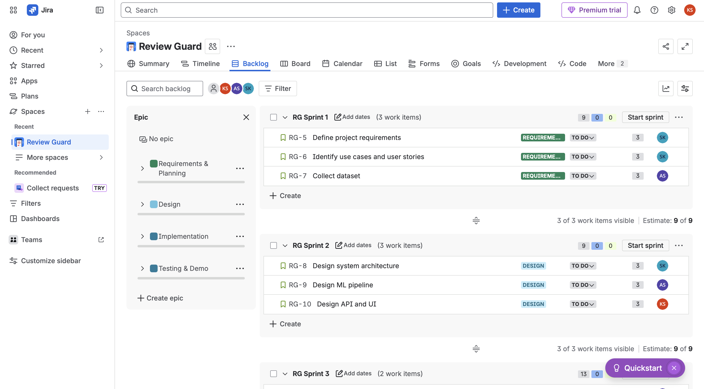

# 🕵️ Review Guard

## 📌 Project Overview

This project was developed by a three-person academic team over 10 weeks (part-time, $0 budget).

The **Review Guard System** is a locally runnable web application that uses **Natural Language Processing (NLP)** and **Machine Learning** to classify online reviews as:

- ✅ Genuine  
- ❌ Fake  

## 🚀 Features
- Single review prediction  
- Batch CSV upload and processing 
- Fake/Genuine classification  
- Fake probability score output  
- Download results as CSV  
- Multiple model support (v1, v2, v3)  
- Fully offline system  


```markdown
## 📂 CSV Format

The CSV file must contain the following columns:

text,rating,helpful_vote,verified_purchase


## 🎯 Project Goals

- Achieve **greater than 80% classification accuracy** on unseen test data  
- Develop a **fully offline, locally runnable web application**  
- Support both **single review prediction and batch CSV processing**  
- Provide **fake probability scores for each prediction** 
- Follow an **Agile development methodology with iterative improvements**  
- Ensure **fast response time and user-friendly interface**  


## 🛠️ Technologies Used

- **Backend:** Python (Flask)  
- **Frontend:** HTML, CSS, JavaScript  
- **ML/NLP:** Scikit-learn, NLTK  
- **Data Processing:** Pandas, NumPy  
- **Model Storage:** Joblib  
- **Testing:** Pytest  
- **CI/CD:** GitHub Actions  
 

## 📂 Dataset

### Label Definition

- `1` → Fake review  
- `0` → Genuine review  

Note: The model uses binary classification where 1 represents fake and 0 represents genuine.


## 📂 Project Structure

```text
Review-1/
│
├── run.py
├── requirements.txt
├── README.md
├── app/
│   ├── backend/
│   │   ├── __init__.py
│   │   └── app.py
│   ├── frontend/
│   │   ├── templates/
│   │   │   └── index.html
│   │   └── static/
│   │       ├── css/
│   │       └── js/
│   ├── ml/
│   │   ├── __init__.py
│   │   ├── predict.py
│   │   └── training/
│   │       ├── data_processing.py
│   │       ├── feature_engineering.py
│   │       ├── evaluate_model.py
│   │       ├── train_model.py
│   │       └── train_model_v3.py
│   ├── tests/
│   │   ├── test_api_endpoints.py
│   │   ├── test_predict_module.py
│   │   └── test_preprocessing.py
│   ├── artifacts/
│   │   ├── models/
│   │   │   ├── default/
│   │   │   ├── v1/
│   │   │   ├── v2/
│   │   │   └── v3/
│   │   └── reports/
│   ├── data/
│   ├── notebooks/
│   └── src/
└── images/

## ⚙️ Installation
- pip install -r requirements.txt


## ✅ RUN APPLICATION

```bash
python3 run.py


🏋️ Train Models
## Default Training (Recommended)

- python app/ml/training/train_model.py \
--input_csv dataset/amazon_labeled_fake_reviews/final_labeled_fake_reviews.csv \
--phase1_root app \
--random_seed 42


## 🔹 Train Model Versions
- **v1 (Hybrid):** Text + metadata  
- **v2 (Text-only):** Only text features  
- **v3 (Best Model):** Blended model combining v1 + v2  


## v1
- python app/ml/training/train_model.py --include_behavioral --model_version phase1-v1


## v2
- python app/ml/training/train_model.py --model_version phase1-v2


## v3 (Best)
- python app/ml/training/train_model_v3.py

## 🧪 Testing

- 106 test cases implemented  
- 100% pass rate  
- Includes:
  - Unit Testing  
  - Integration Testing  
  - Security Testing  
  - Regression Testing  


## Optional (Advanced)

- python app/ml/training/train_model.py --enable_xgboost

## Run Tests
- python3 -m pytest -q app/tests


📊 Model Evaluation
- Accuracy (>80%)
- Precision
- Recall
- F1-Score


⚠️ Risk & Validation
- To avoid data leakage:
- Text normalization + hashing
- Duplicate-safe splitting
- Near-duplicate audit
- Remaining Risk
- Paraphrased reviews may still exist → residual risk

## ⚙️ CI/CD

- GitHub Actions used  
- Automated testing on every push  


## 📊 Project Management (Jira)

The project was managed using Jira with sprint planning and task tracking.


### 🗂️ Jira Board Overview



## 📅 Agile Milestones
- Planning & Dataset Preparation
- Model Development & Evaluation
- Web Application Integration
- Testing & Final Delivery


## 👥 Team
- Kriti Subedi
- Swapnali Kudale
- Aditi Sharma


## 📜 License
Developed for academic purposes only.